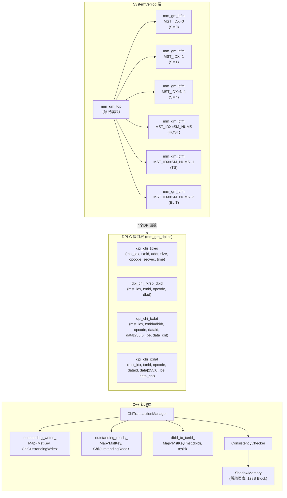
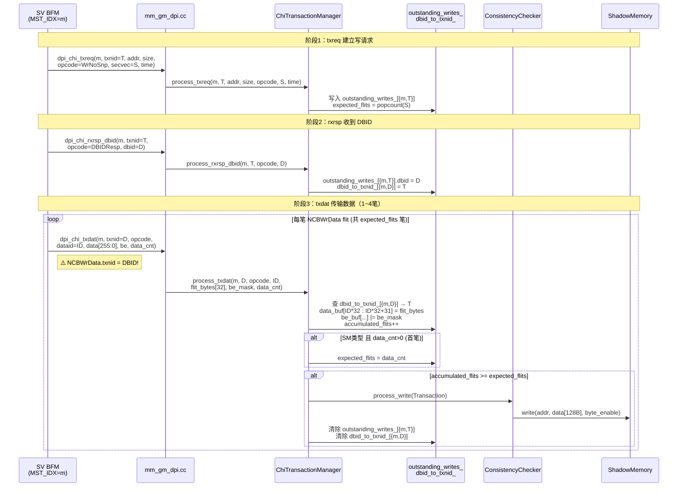
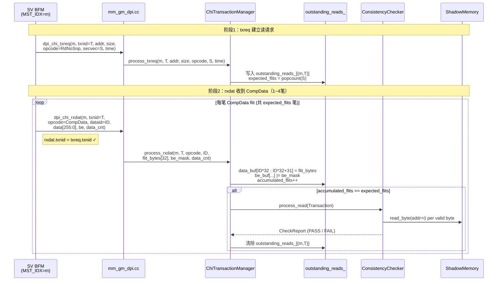
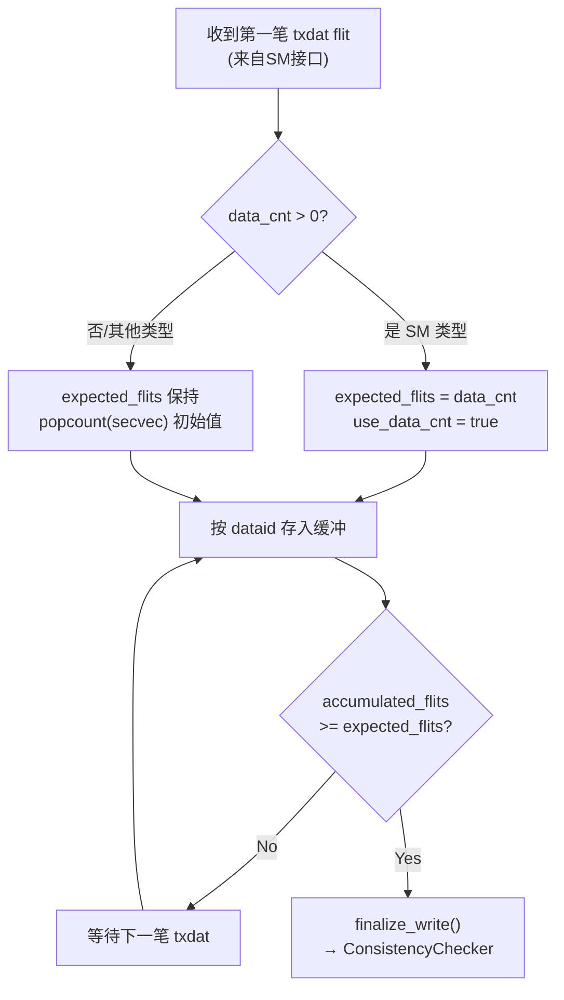
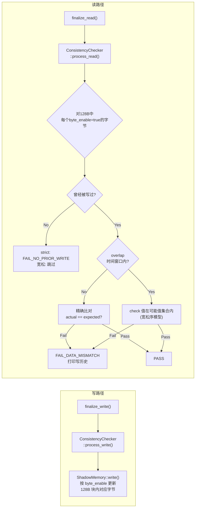

# CHI BFM DPI-C Golden Memory 架构说明

## 1. 系统总览



---

## 2. MST_IDX 编号规则

| BFM实例 | MST_IDX | 说明 |
|---------|---------|------|
| SM0 | 0 | genvar idx=0 |
| SM1 | 1 | genvar idx=1 |
| ... | ... | ... |
| SM(N-1) | SM_NUMS-1 | genvar idx=N-1 |
| HOST | SM_NUMS | 固定=8（默认SM_NUMS=8） |
| TS | SM_NUMS+1 | 固定=9 |
| BLIT | SM_NUMS+2 | 固定=10 |

> **关键**：同一个BFM实例内，txnid空间相互独立。不同BFM可能同时使用相同txnid，通过 `MstKey = {mst_idx, txnid}` 在C++侧唯一区分。

---

## 3. 写事务（WrNoSnp）三阶段流程



---

## 4. 读事务（RdNoSnp）两阶段流程



---

## 5. secvec 与 dataid 数据拼接

### 5.1 secvec：有效段选择（4-bit）

```
                 1024-bit Cacheline (128 Bytes)
┌────────────┬────────────┬────────────┬────────────┐
│  Bytes     │  Bytes     │  Bytes     │  Bytes     │
│  [0 : 31]  │  [32: 63]  │  [64: 95]  │  [96:127]  │
│  (256-bit) │  (256-bit) │  (256-bit) │  (256-bit) │
└────────────┴────────────┴────────────┴────────────┘
      ↑              ↑           ↑            ↑
   secvec[0]    secvec[1]   secvec[2]    secvec[3]

示例：secvec = 4'b0101 (= 0x5)
  → bit0=1: bytes[0:31]   有效 ✓
  → bit1=0: bytes[32:63]  无效 ✗
  → bit2=1: bytes[64:95]  有效 ✓
  → bit3=0: bytes[96:127] 无效 ✗

expected_flits = popcount(0x5) = 2
```

### 5.2 dataid：flit在缓冲区中的位置

```
dataid[1:0] │ byte_offset = dataid * 32
────────────┼──────────────────────────
   2'b00    │  0  → data_buf[0  :31 ]
   2'b01    │  32 → data_buf[32 :63 ]
   2'b10    │  64 → data_buf[64 :95 ]
   2'b11    │  96 → data_buf[96 :127]
```

### 5.3 完整数据组装示例（secvec=0xA，写事务）

```
secvec=4'b1010：bit1=1(bytes[32:63]), bit3=1(bytes[96:127])
expected_flits = 2

flit①: dataid=2'b01 → data_buf[32:63] = flit_data, be_buf[32:63] = be_mask
flit②: dataid=2'b11 → data_buf[96:127]= flit_data, be_buf[96:127]= be_mask

最终128B缓冲：
┌────────────┬────────────┬────────────┬────────────┐
│ xxxxxxxxxx │ ▓▓▓▓▓flit①│ xxxxxxxxxx │ ▓▓▓▓▓flit②│
│ be=false   │ be=per-bit │ be=false   │ be=per-bit │
└────────────┴────────────┴────────────┴────────────┘
                         ↓
              ShadowMemory.write()
              只更新 byte_enable=true 的字节
```

---

## 6. data_cnt 特性（SM 专属）



> **注意**：`data_cnt` 只在 SM 接口有意义。其他接口（HOST/TS/BLIT）传 `data_cnt=0`，以 `secvec` 的 popcount 为准。

---

## 7. 一致性检查机制



---

## 8. 修改文件一览

| 文件 | 修改内容 |
|------|---------|
| `include/types.h` | 新增 CHI 常量（`CHI_FLIT_BYTES`=32, `CHI_CL_BYTES`=128）、opcode枚举、`secvec_to_flits()`、`dataid_to_offset()`；`CACHELINE_SIZE`→128 |
| `include/transaction.h` | 添加 `secvec` 字段；`src_id` 语义→`mst_idx`；`byte_en_at()` 默认改为 `false`；更新 `to_string()` |
| `include/chi_transaction_manager.h` | **全面重构**：`TxnKey`→`MstKey{mst_idx,txn_id}`；新增 `ChiOutstandingRead`；更新所有方法签名 |
| `src/chi_transaction_manager.cc` | **全面重构**：实现读写分离、dataid组装、data_cnt支持、dbid逆向映射 |
| `src/mm_gm_dpi.cc` | **全面重构**：新增 `mst_idx`；`dpi_chi_txreq_write`→`dpi_chi_txreq`；`unpack_flit256()` |
| `src/consistency_check.cc` | `process_read()` 新增 `byte_en_at(i)` 跳过逻辑；`track_active_write()` 步长改为 `CHI_CL_BYTES` |
| `src/transaction_manager.cc` | 修复 `txn.master_id`→`txn.src_id`；新增 `tgt_id`/`dbid`/`secvec` 初始化 |
| `test/unit_test_checker.cc` | `make_write_txn`/`make_read_txn` 新增 `secvec=0xF` 初始化 |
| `sv/mm_gm_bfm.sv` | 新增 `MST_IDX` 参数；所有DPI函数加 `mst_idx` 参数；`dpi_chi_txreq_write`→`dpi_chi_txreq`；读写txreq合并 |
| `sv/mm_gm_top.sv` | 所有BFM实例化添加 `.MST_IDX(idx/SM_NUMS/SM_NUMS+1/SM_NUMS+2)` |
